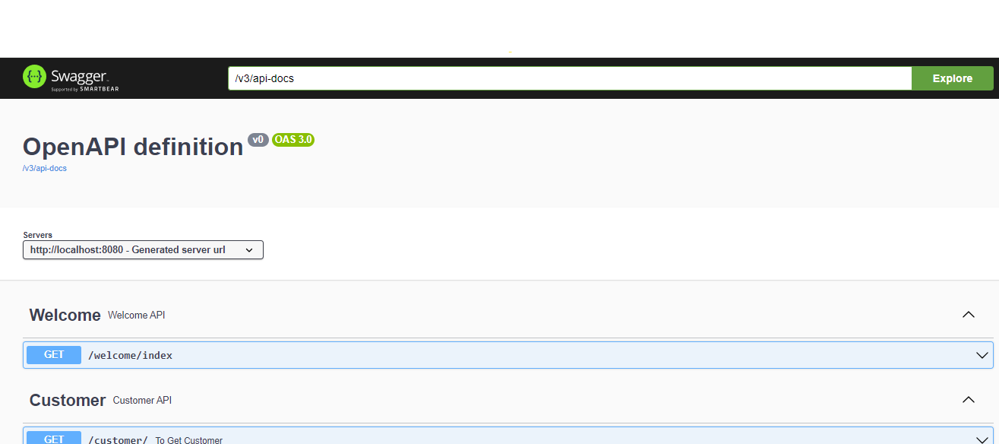

# assessment

Step 1: Update db connection at application.properties then run

Step 2: open http://localhost:8080/swagger-ui/index.html

Step 3: To Insert dummy data please execute **/welcome/index**

